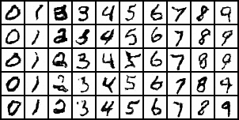

# GAN-zoo

A collection of GAN models implemented in PyTorch:

 * Basic GAN on MNIST [code](https://github.com/vmirly/PyTorch-GAN-zoo/tree/master/basic_gan)
 * Conditional GAN on MNIST [code](https://github.com/vmirly/PyTorch-GAN-zoo/tree/master/cond_gan)
 * Pix2Pix on FACADES dataset [code](https://github.com/vmirly/PyTorch-GAN-zoo/tree/master/pix2pix)

## References - part 1

 * GAN [arxiv](https://arxiv.org/abs/1406.2661)
 * Wasserstein GAN [arxiv](https://arxiv.org/abs/1701.07875)
 * DCGAN [arxiv](https://arxiv.org/abs/1511.06434)
 * Conditional GANs [arxiv](https://arxiv.org/abs/1411.1784)
 * LSGAN [arxiv](https://arxiv.org/abs/1611.04076)
 * SAGAN [arxiv](https://arxiv.org/abs/1805.08318)
 * Pix2Pix [arxiv](https://arxiv.org/abs/1611.07004)
 * Pix2Pix-HD [arxiv](https://arxiv.org/abs/1711.11585) [PyTorch imp.](https://github.com/NVIDIA/pix2pixHD)
 * CycleGAN [arxiv](https://arxiv.org/abs/1703.10593) [code](https://github.com/junyanz/pytorch-CycleGAN-and-pix2pix)
 * StarGAN [arxiv](https://arxiv.org/abs/1711.09020) [PyTorch imp.](https://github.com/yunjey/stargan)
 * Geometric GAN [arxiv](https://arxiv.org/abs/1705.02894)
 * InfoGAN [arxiv](https://arxiv.org/abs/1606.03657)
 * BigGAN [arxiv](https://arxiv.org/abs/1809.11096)
 * ConSinGAN [arxiv](https://arxiv.org/abs/2003.11512) [code](https://github.com/tohinz/ConSinGAN)
 * OT-GAN [arxiv](https://arxiv.org/abs/1803.05573)

## References - part 2
 
 * Improved Techniques for Training GANs [arxiv](https://arxiv.org/abs/1606.03498)
 * On Convergence and Stability of GANs [arxiv](https://arxiv.org/abs/1705.07215)
 * Which Training Methods for GANs do actually Converge? [arxiv](https://arxiv.org/abs/1801.04406)
 * Is generator conditioning causally related to GAN performance? [arxiv](https://arxiv.org/abs/1802.08768)
 * The unusual effectiveness of averaging in gan training [arxiv](https://arxiv.org/abs/1806.04498)
 * cGANs with projection discriminator [arxiv](https://arxiv.org/abs/1802.05637)
